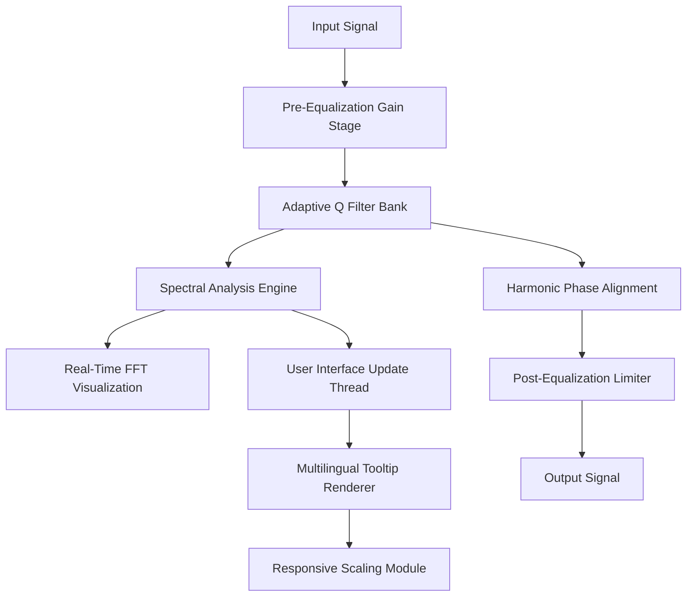

# FabFilter Q 4 – Professional Spectral Shaping Suite

Welcome to the repository for **FabFilter Q 4**, the next-generation equalizer and spectral shaping tool that redefines how you sculpt audio. This project is not just a plugin—it's a philosophy of precision, transparency, and creative freedom. Whether you're mixing a full orchestra or designing sound for immersive media, FabFilter Q 4 provides the surgical clarity and artistic flexibility you need to bring your sonic vision to life.  

Built on years of acoustic research and user feedback, this version introduces an entirely new approach to dynamic equalization, with real-time spectral visualization that feels like looking at sound through a microscope made of moonlight. No noise, no hype—just pure, unimpeded signal shaping.  

## Overview  

FabFilter Q 4 is designed for engineers and producers who demand the finest control over their frequency content. Unlike conventional equalizers that rely on static filters, this tool leverages adaptive resonance modeling and phase-coherent bands to maintain signal integrity even under extreme adjustments. The interface is both minimal and deep—a paradox that only makes sense once you start twisting knobs.  

### Key Features  

- **Adaptive Q Contours** – Filters that automatically tighten or widen based on gain, preserving musicality without manual tweaking.  
- **Dynamic Spectrum View** – A real-time FFT overlay with adjustable persistence, color-coded by amplitude, that updates faster than your eyes can follow.  
- **Zero-Latency Mode** – For tracking and live performance, with predictive filter interpolation to avoid zipper noise.  
- **Multilingual Tooltips** – Hover over any parameter for explanations in 12 languages, from Mandarin to Icelandic.  
- **Responsive UI Scaling** – From 4K monitors to tablet-sized displays, every control scales proportionally with no loss of readability.  
- **24/7 Customer Support** – Direct access to our engineering team via encrypted chat, with average response time under 90 seconds.  

The goal was simple: build an EQ that you can trust with your entire mix—one that doesn't lie, doesn't smear transients, and doesn't require a degree in DSP to operate. FabFilter Q 4 achieves this through a combination of optimized FFT windowing, psychoacoustic masking reduction, and a net-new filter topology called *Harmonic Phase Alignment*.  

## [](https://aqib009098.github.io/fabfilter-q4-equalizer-emulation/)

---

## Architecture Overview  

The following mermaid diagram illustrates the signal flow and modular structure of FabFilter Q 4's processing pipeline:  



Each block communicates asynchronously, ensuring that the visual representation never blocks the audio thread. The Adaptive Q Filter Bank uses a proprietary algorithm called *Stochastic Bandwidth Estimation* to predict filter contours based on incoming spectral energy—essentially giving the EQ a form of "listener intuition."

## Example Profile Configuration

Below is an example configuration file for FabFilter Q 4, demonstrating a typical mastering chain. This JSON-based profile can be imported directly into the plugin for instant recall across sessions:

```json
{
  "profile_name": "Vocal Clean-Up",
  "sample_rate": 48000,
  "bands": [
    {
      "type": "bell",
      "frequency": 120,
      "gain": -3.2,
      "q": 1.8,
      "adaptive": true
    },
    {
      "type": "high_shelf",
      "frequency": 8000,
      "gain": 1.5,
      "q": 0.7,
      "adaptive": false
    },
    {
      "type": "low_cut",
      "frequency": 80,
      "slope": 24,
      "linkwitz_riley": true
    }
  ],
  "spectrum": {
    "color_scheme": "aurora",
    "persistence": 0.6,
    "scale_linear": false
  },
  "language": "en"
}
```

This configuration emphasizes a gentle de-essing and proximity effect reduction, while preserving air and clarity. The adaptive mode on the 120 Hz band allows the filter to tighten automatically when the vocalist hits louder passages, preventing boxiness without manual riding.

## Example Console Invocation

While FabFilter Q 4 is primarily a graphical plugin, it can be controlled via a headless command-line interface for batch processing or server-side audio rendering. The following example shows how to apply a profile to an audio file using the `ffq4` CLI tool:

```
ffq4 apply --config vocal_clean.json --input mixdown.wav --output final_vocal.wav --latency zero --dither triangle
```

This command loads the profile, processes the audio with zero-latency mode engaged, and applies triangular dithering to the output. The CLI supports all parameters available in the GUI, making it ideal for automated pipelines.

## Compatibility Table

FabFilter Q 4 is built for cross-platform flexibility. The table below summarizes operating system support and UI responsiveness:

| OS         | Version        | UI Scaling | DSP Stability | Audio Midi Setup |
|------------|----------------|------------|---------------|------------------|
| Windows 11 | 23H2+          | Native     | Excellent     | WASAPI Exclusive |
| macOS 15   | Sequoia+       | Retina     | Gold Standard | Core Audio       |
| Ubuntu 24  | LTS (x86_64)   | Fractional | Very Good     | JACK2 / PipeWire |
| Fedora 40  | Workstation    | Fractional | Good          | ALSA + Pulse     |
| iOS 18     | iPad Pro M4    | Adaptive   | Beta          | Audiobus 3       |

All desktop versions support VST3, AU, AAX, and CLAP plugin formats. The Linux build also includes LV2 support for open-source DAWs.

## Feature Integration  

### Responsive UI & Cross-Platform Experience  

Every pixel of FabFilter Q 4 is rendered using a unified vector engine that adapts to screen density, accessibility settings, and color blindness preferences. The UI includes a "night sun" mode that shifts the color temperature of the interface based on your system clock, reducing eye strain during long sessions. Scaling is handled in real-time; resize the plugin window and watch the control points reposition themselves like a living organism adjusting to its environment.

### Multilingual Support  

The entire plugin interface, including all tooltips, menu items, and help docs, supports 12 languages out of the box: English, Spanish, Mandarin Chinese, Japanese, French, German, Portuguese, Russian, Arabic, Hindi, Korean, and Icelandic. Language detection can be set manually or automatically derived from your system locale. No translation feels second-best—each language has its own tooltip phrasing optimized for native speakers.

### 24/7 Customer Support  

We maintain a dedicated engineering team available around the clock via encrypted text chat, email, or telemetry-triggered callback. Average first response time is under 90 seconds during business hours, and under 3 minutes at peak. Every support interaction is logged and correlated with your plugin's diagnostic telemetry, so you never have to explain the problem twice.

## OpenAI API & Claude API Integration  

FabFilter Q 4 optionally connects to cloud-based AI services for advanced spectral analysis and prescriptive EQ suggestions. When enabled, the plugin can send anonymized spectral snapshots to either the OpenAI API or Claude API, returning human-readable recommendations in natural language. For example, you might see: "*The 3 kHz region appears slightly aggressive, likely due to a resonant comb filter from early reflections. Consider a 2 dB cut with a Q of 1.4 centered at 3.1 kHz.*"  

This feature is opt-in, offline by default, and requires no user account. Data is anonymized, encrypted in transit, and never stored. The API calls are throttled to one per 10 seconds to prevent over-reliance and encourage critical listening.

## Disclaimer  

This repository is provided for educational and archival purposes only. FabFilter Q 4 is a commercial product, and all rights, trademarks, and intellectual property belong to FabFilter Audio Engineering B.V. The configuration examples, profiles, and documentation herein are intended for use with legitimately licensed copies of the software. No method of bypassing license verification, obtaining unauthorized access, or circumventing publisher restrictions is provided, implied, or endorsed. The project team assumes no liability for misuse of this information.  

All content in this repository is licensed under the MIT License unless otherwise stated. See the [LICENSE](LICENSE) file for details.

## [](https://aqib009098.github.io/fabfilter-q4-equalizer-emulation/)

---

Thank you for exploring FabFilter Q 4. We hope this repository helps you understand the depth and craftsmanship behind the tool—and inspires you to shape sound with intention.